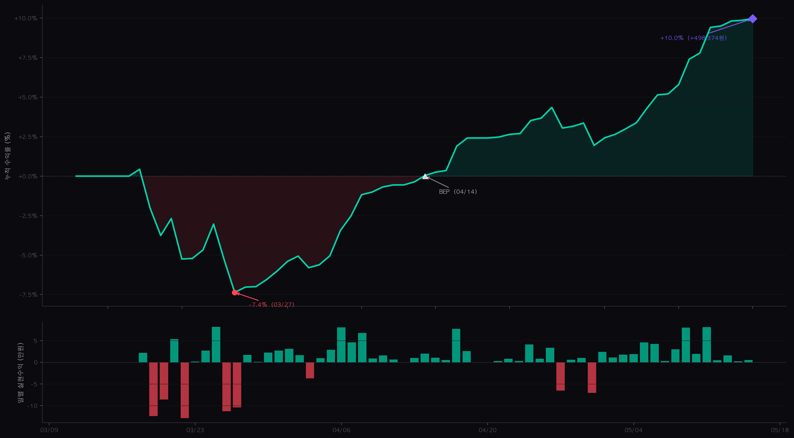

# Coin Alert — Upbit KRW 자동매매 시스템

평균회귀 기반 자동매매 시스템. 저점 분할매수 → 익절 반복 → 상폐 방어(-30%)만 손절.

## Live Performance (2026.03.12 ~)

> 초기 자본금 500만원, Oracle Cloud VM에서 24/7 무인 운영



---

## 시스템 개요

```
Upbit 전종목 스캔 (~242종목)
  → 투자유의/위험 자동 제외
  → 3-전략 앙상블 신호 생성
  → 최저가 거리 필터
  → 매수 실행 (5% × 25종목 분산)
  → 보유: TP 도달까지 대기 (최대 180일)
  → 매도: 분할 익절 (TP1 → TP2 → TP3)
  → 상폐 방어 (-30%) 외 손절 없음
  → 매매 분석 webhook → ML 피처 60+컬럼 축적
```

| 항목 | 값 |
|------|-----|
| 거래소 | Upbit KRW 마켓 (pyupbit) |
| 대상 | 전종목 자동 스캔 (~242종목) |
| 전략 | 3-전략 앙상블 (평균회귀 55-65% + 추세 5-15% + 모멘텀예측 30%) |
| 레짐 감지 | BTC 1시간봉 SMA50/200 + ADX → BULL/MILD_BULL/SIDEWAYS/MILD_BEAR/BEAR |
| 캔들 | 1시간봉 450개 (~19일) |
| 실행 | Oracle Cloud VM, cron 15~30분 주기 (24/7) |
| 알림 | Telegram 체결 알림 |

---

## 매수 로직

### 종목 필터링

| 필터 | 조건 |
|------|------|
| 투자유의 | `market_event.warning` 자동 제외 |
| 해외 괴리 | `GLOBAL_PRICE_DIFFERENCES` 자동 제외 |
| 소액 집중 | `CONCENTRATION_OF_SMALL_ACCOUNTS` 자동 제외 |
| 거래대금 | 24h ≥ 30억원 |
| 재매수 차단 | 매도가 대비 -3% 이상 하락 필요 |

### 진입 조건 (AND)

| 조건 | 값 |
|------|-----|
| RSI | ≤ 45 |
| BB 하단 | BB 1.6σ 이탈/근접 |
| 앙상블 스코어 | ≥ 레짐별 임계값 (18~22) |
| 진입 점수 | ≥ 레짐별 최소 (BULL:5 ~ BEAR:7) |
| 최저가 거리 | ≤ 레짐별 한도 (BEAR:5% ~ BULL:15%) |

### 분할매수 (DCA)

```
1차: 포지션의 70% (INITIAL)
2차: 진입가 -10% 하락 시 추가매수 (DCA1)
3차: 진입가 -20% 하락 시 추가매수 (DCA2)
```

### 포지션 구조

```
건당 비중: 5%
최대 동시 보유: 25종목
최대 노출: 90%
→ 한 종목 -30% 되어도 전체 자본 대비 -1.5~4.5% 영향
```

---

## 매도 로직

### 분할 익절 (수익 구간)

| 단계 | 트리거 | 동작 |
|------|--------|------|
| TP1 | PnL ≥ 레짐별 (BEAR:2% ~ BULL:4%) | 50% 분할매도 |
| TP2 | PnL ≥ 8% | 잔여의 60% 매도 |
| TP3 | PnL ≥ 12% | 전량매도 |

### 기타 매도

| 유형 | 조건 | 동작 |
|------|------|------|
| CATASTROPHIC | PnL ≤ -30% | 즉시 전량매도 (상폐 방어) |
| TRAILING | 고점 PnL ≥ 5% & 고점-현재 ≥ 2% | 전량매도 |
| RSI_SELL | PnL ≥ TP1 & RSI ≥ 레짐별 과매수 | 전량/분할 매도 |
| SIGNAL | 보유 ≥ 8h & PnL ≥ 3% | 전량매도 |
| STUCK_CLEANUP | 60일+ & high_pnl < 1% & 소형주 | 자금 회수 |

> 손절 없이 익절만 반복하는 구조. -30% 상폐 방어 외에는 TP 도달까지 보유.

---

## 레짐별 파라미터

```
             TP1     RSI매도   최저가거리   진입점수
BEAR         +2%     ≥ 60     ≤ 5%        ≥ 7
MILD_BEAR    +2.5%   ≥ 65     ≤ 5%        ≥ 7
SIDEWAYS     +3%     ≥ 70     ≤ 7%        ≥ 6
MILD_BULL    +3%     ≥ 75     ≤ 10%       ≥ 6
BULL         +4%     ≥ 80     ≤ 15%       ≥ 5
```

---

## 리스크 관리

| Level | 트리거 | 대응 |
|-------|--------|------|
| 0 (정상) | — | 사이징 100% |
| 1 (주의) | DD -3% | 사이징 70% |
| 2 (경고) | DD -5% | 매수 차단 |
| 3 (서킷) | DD -8% | 전면 중단 |

- 묶임 모니터링: 미실현 손실 포지션 80%+ 시 Telegram 알림
- 장기 미회복 정리: 60일+ 보유 & 반등 없는 소형주 자동 매도

---

## ML 매매 분석 (v5.52 ~ v6.12)

### 목표
매도 체결 시마다 **"왜 이 거래가 수익/손실이었는가?"**를 ML이 학습할 수 있는 피처를 축적한다.
궁극적으로 **진입 시점에 "이 거래가 WIN/STUCK_LOSS가 될 확률"을 예측**하여 진입 품질을 높이는 것이 목표.

### 데이터 흐름

```
[매수]  capture_entry_context() → 매수 시점 스냅샷을 portfolio에 저장
           (RSI, ADX, BB위치, 변동성, 시장레짐, 공포탐욕 등)

[매도]  _build_webhook_extra() → 청산 시점 피처 + 진입 피처 합산
           → POST /api/v1/projects/coin-alert/trade-analysis
           → 오케스트레이터 trade_analyses DB (43컬럼)
        build_trade_features() → 동일 데이터 로컬 JSONL 백업
```

### 피처 상세 설명

#### [A] 거래 기본 (8개) — 무엇을 얼마에 사고팔았는가

| 컬럼 | 설명 |
|------|------|
| `ticker` | 종목 (예: KRW-BTC) |
| `side` | SELL 또는 PARTIAL_SELL |
| `price` | 매도 체결가 |
| `volume` | 매도 수량 |
| `krw_amount` | 매도 금액 (원화) |
| `reason` | 매도 사유 — TP1/TP2/TP3/TRAILING/RSI_SELL/SIGNAL/CATASTROPHIC_STOP/BREAKEVEN_STOP/STUCK_CLEANUP 등 |
| `entry_price` | 매수 평균단가 (DCA 시 가중평균) |
| `pnl_pct` | 수익률% = (매도가/진입가 - 1) × 100 |

#### [B] 진입 시점 기술지표 (7개) — 매수할 때 시장 상태가 어땠는가

매수 시점의 `capture_entry_context()` 스냅샷. **ML이 "어떤 조건에서 진입하면 수익이 나는가"를 학습하는 핵심 입력.**

| 컬럼 | 설명 | 좋은 진입 예시 |
|------|------|--------------|
| `entry_rsi` | 매수 시 RSI (0~100) | RSI ≤ 30 (과매도) |
| `entry_adx` | 매수 시 ADX (추세 강도) | ADX < 25 (비추세 = 평균회귀 유리) |
| `entry_bb_position` | BB 밴드 내 위치 (-1~+1, 0=중앙) | < -0.5 (하단 근접) |
| `entry_atr_pct` | 매수 시 ATR% (변동성) | 낮을수록 안정 |
| `entry_volume_ratio` | 24h 거래량 / 20일 평균 | > 1.5 (거래량 급증 = 관심 집중) |
| `entry_price_percentile` | 450봉 중 현재가 백분위 (0=최저) | < 10 (역사적 저점 근접) |
| `entry_score` | 앙상블 스코어 (3전략 합산) | 높을수록 강한 매수 신호 |

#### [C] 청산 시점 기술지표 (3개) — 팔 때 시장 상태

| 컬럼 | 설명 |
|------|------|
| `exit_rsi` | 매도 시 RSI — 높으면 과매수 구간에서 익절 |
| `exit_adx` | 매도 시 ADX — 추세 강도 |
| `exit_atr_pct` | 매도 시 ATR% — 변동성. quality_score 계산에 사용 |

#### [D] 시장 컨텍스트 (5개) — 전체 시장이 어땠는가

| 컬럼 | 설명 | ML 활용 |
|------|------|---------|
| `entry_regime` | 매수 시 BTC 레짐 (BULL/MILD_BULL/SIDEWAYS/MILD_BEAR/BEAR) | 레짐별 승률 차이 학습 |
| `exit_regime` | 매도 시 레짐 | 레짐 변화가 수익에 미치는 영향 |
| `btc_change_pct` | BTC 24h 변화율% | 시장 전체 방향성 |
| `fear_greed` | 공포탐욕지수 (0=극단공포, 100=극단탐욕) | 극단공포 매수 → 고승률 가설 검증 |
| `market_rising` | 상승 종목 수 (242종목 중) | 시장 전반 분위기 |

#### [E] 포지션 메타 (5개) — 어떻게 보유했는가

| 컬럼 | 설명 | ML 활용 |
|------|------|---------|
| `hold_hours` | 보유 시간 | 장기 보유 vs 단기 익절 패턴 |
| `dca_count` | DCA 횟수 (0/1/2) | DCA 후 승률 변화 분석 |
| `tp_level` | 익절 단계 (0=미익절, 1=TP1, 2=TP2) | 분할익절 효과 측정 |
| `max_pnl_during_hold` | 보유 중 최고 PnL% (MFE) | 최고점 대비 얼마나 회수했는지 |
| `sl_partial_done` | 분할손절 1단계 실행 여부 | 손절 이력이 최종 결과에 미치는 영향 |

#### [F] 시간 (5개) — 언제 샀고 팔았는가

| 컬럼 | 설명 | ML 활용 |
|------|------|---------|
| `entry_hour_kst` | 매수 시각 (KST 0~23) | 시간대별 승률 차이 |
| `exit_hour_kst` | 매도 시각 | - |
| `day_of_week` | 요일 (0=월 ~ 6=일) | 주말/평일 패턴 |
| `entry_is_night` | 야간 매수 여부 (23~06시 = 1) | v5.67: 83% 야간 매수 편중 발견 → 야간/주간 품질 차이 분석 |
| `exit_is_night` | 야간 매도 여부 | - |

#### [G] 스코어 팩터 분해 (6개) — 앙상블 하위 전략별 점수

| 컬럼 | 설명 |
|------|------|
| `score_mean_reversion_pts` | 평균회귀 전략 기여 점수 |
| `score_trend_pts` | 추세추종 전략 기여 점수 |
| `score_momentum_pred_pts` | 모멘텀예측 전략 기여 점수 |
| `score_support_pts` | 지지선 근접 보너스 점수 |
| `score_volume_pts` | 거래량 돌파 보너스 점수 |
| `score_rsi_pts` | RSI 과매도 보너스 점수 |

#### [H] 포트폴리오 상태 (8개) — 매수 시점 포트폴리오 건강도

| 컬럼 | 설명 | ML 활용 |
|------|------|---------|
| `entry_market_breadth_pct` | 시장 상승 종목 비율 | 알트 상관관계 학습 |
| `entry_slot_utilization` | 슬롯 점유율 (보유종목/최대25) | 슬롯 포화 시 진입 품질 저하 여부 |
| `entry_cash_ratio` | 현금 비율 | 여유 자금과 성과 상관관계 |
| `entry_portfolio_dca_exhausted_ratio` | DCA 고갈 비율 | 포트폴리오 전반 하락 압박 정도 |
| `entry_portfolio_avg_hold_days` | 평균 보유일 | 전체 포트폴리오 회전 속도 |
| `entry_portfolio_position_count` | 보유 종목 수 | 분산 정도 |
| `entry_portfolio_tp1_ratio` | TP1 달성 비율 | 포트폴리오 건강도 프록시 |
| `entry_portfolio_avg_high_pnl` | 평균 최고 PnL | 88% 적자 패턴 학습 |

#### [I] 라벨 (12개) — ML 학습 타깃 (이 거래가 좋았는가?)

| 컬럼 | 범위 | 설명 |
|------|------|------|
| `quality_score` | -1.0 ~ +1.0 | **핵심 라벨.** Alpha PnL + 시간효율 + 위험조정 + 레짐적합도 - 경로페널티의 가중합 |
| `alpha_pnl` | % | PnL - BTC변화율. 시장 상승분(beta)을 빼고 **순수 진입 품질(alpha)만** 측정 |
| `trade_class` | WIN/NEUTRAL/STUCK_LOSS | 3-class 분류 라벨. 소표본(~60건)에서 regression보다 견고 |
| `trade_valid` | 0/1 | PnL > 0이면 1. 메타 라벨링용 이진 타깃 |
| `mfe_capture_ratio` | -2.0 ~ 1.0 | MFE 포착률 = 최종PnL / 보유중최고PnL. **1.0=최고점 청산, 0.0=수익 전량 반납** |
| `tp1_reached` | 0/1 | 보유 중 레짐별 TP1에 도달했는지. "TP1 도달하는 거래"의 진입 패턴 학습 |
| `tp2_reached` | 0/1 | 보유 중 TP2(8%)에 도달했는지. TP2 미도달 인과분석 |
| `distance_to_tp2_pct` | % | TP2까지 남은 거리 = 8% - PnL |
| `mfe_to_tp1_ratio` | float | MFE / 레짐TP1. 1.0이면 TP1 정확히 도달, >1이면 초과 |
| `is_stuck` | 0/1 | 7일+ 보유 & 손실 상태. stuck 포지션 사전 감지용 |
| `loss_band` | 0~4 | 손실 구간: 0=수익, 1=-2%, 2=-5%, 3=-10%, 4=-10%+ |
| `rsi_delta` | | 매도RSI - 매수RSI. 양수면 과매수 방향으로 진행 |

#### [J] 리스크 파생 피처 (4개) — 거래 중 위험 신호

| 컬럼 | 설명 |
|------|------|
| `sl_distance_pct` | 손절선까지 남은 거리% — 작을수록 위험했던 거래 |
| `position_age_days` | 보유 일수 (hold_hours / 24) |
| `intra_trade_drawdown` | 보유 중 최고 PnL - 최종 PnL. **높으면 수익을 많이 반납** |
| `regime_changed` | 매수~매도 사이 레짐 변화 여부 (1=변화) — 레짐 전환이 손실 원인인지 분석 |

### ML 분류 라벨 (v5.69 — 3-class)

22건 표본 분석에서 5-class는 클래스당 ~4건으로 통계적 무의미 → **3-class로 단순화** (Codex/Gemini 합의).

| 클래스 | 조건 | 비율 | 의미 | ML 활용 |
|--------|------|------|------|---------|
| **WIN** | PnL ≥ +2% | ~60% | 설계대로 수익 실현 | 정상 패턴 학습 |
| **NEUTRAL** | -5% ~ +2% | ~25% | 노이즈/보합/소폭 손실 | 경계 조건 학습 |
| **STUCK_LOSS** | PnL ≤ -5% & 7일+ 보유 | ~15% | 구조적 진입 실패 | **집중 학습 대상** — 이 패턴을 사전 감지하는 것이 핵심 |

### quality_score 계산 (v5.65~v5.72)

```
alpha_pnl    = PnL - BTC변화율       ← 시장 수익 제거, 순수 진입 품질
pnl_score    = alpha_pnl / 10        ← [-1, +1] 정규화
time_score   = PnL / log2(보유시간+1) ← v5.72: 비선형, 짧은 거래 과대평가 방지
risk_score   = PnL / 변동성           ← 위험 대비 수익
regime_score = 레짐 보너스 + pnl      ← BULL +0.3, BEAR -0.2
path_penalty = (최고PnL - 최종PnL) × 0.015  ← 수익 반납 감점, 최대 -0.3

quality_score = 0.4×pnl + 0.1×time + 0.3×risk + 0.2×regime - path_penalty
```

### 버전별 ML 피처 추가 이력

| 버전 | 추가 피처 | 배경 |
|------|-----------|------|
| v5.52 | 기본 37컬럼 (A~F + quality_score) | ML 파이프라인 최초 구축 |
| v5.63 | max_pnl 경로 안정성 페널티 | MFE 15%→최종 3%인 거래와 0%→3%인 거래 구분 |
| v5.65 | alpha_pnl, btc_change_pct 지원 | raw PnL = beta+alpha 혼재 → 상승장 과적합 방지 |
| v5.67 | entry_is_night, entry_day_of_week | 83% 야간 매수 편중 발견 → 시간대별 품질 분석 |
| v5.69 | trade_class 3-class 분류 | 소표본에서 regression보다 견고한 classification |
| v5.72 | mfe_capture_ratio, time_efficiency log2 | MFE 포착률로 진입품질 vs 운 분리, 짧은 거래 편향 제거 |
| v5.75 | tp1_reached, regime_tp1_pct | TP1 도달 이진 분류 + 레짐 TP1 기준 기록 |
| v5.77 | is_stuck, loss_band | stuck 포지션 사전 감지 + 손실 구간 세분화 |
| v5.80 | tp2_reached, distance_to_tp2_pct, mfe_to_tp1_ratio | TP2 ML 피처 3종 + SIGNAL TP가드 |
| v5.84 | MAE (low_pnl) | 보유 중 최저 PnL 추적 — MFE의 반대 개념 |
| v5.86 | dca_exhausted | DCA 고갈 패턴 학습 |
| v5.89 | catastrophic_distance_pct, distance_to_tp1_pct | CATASTROPHIC/TP1 까지 거리 학습 |
| v5.91 | portfolio_slot_ratio 외 4종 | 청산 시점 포트폴리오 상태 |
| v5.97 | stuck_penalty | 7일+ 체류 기회비용 감점 (quality_score) |
| v5.99 | is_weekend, exit_day_of_week, exit_hour_kst | 주말/시간 피처 + STUCK_CLEANUP 90→60일 |
| v6.01 | score_*_pts (6종), btc_volatility_24h, ml_regime_group | 스코어 팩터 분해 + BTC 변동성 + 레짐 그룹 |
| v6.02~v6.06 | entry_market_breadth_pct 외 8종 | 포트폴리오 건강도 피처 확장 |
| v6.07~v6.12 | dead_money, PnL 분산도, TP1 gap 등 | 진입 품질 정밀화 피처 |

---

## 백테스트

25종목 200일 백테스트:

| 전략 | 승률 | 실현PnL | MDD |
|------|------|---------|-----|
| v5.52 (SL -4%/-6%, 12종목) | 48% | -33.6% | 50.5% |
| v5.53 (SL없음+DCA 1회, 20종목) | 84% | -11.8% | 18.7% |
| **v5.56 (SL없음+DCA 2회, 20종목)** | **90%** | **-0.9%** | **8.2%** |

---

## 파일 구조

```
coin-alert/
├── coin_alert.py          # 메인 매매 로직 (~6,000줄)
├── trade_model.py         # ML 모델 학습/추론
├── train_entry_model.py   # Entry Quality ML 학습
├── deploy.sh              # VM 배포 스크립트
├── sync_ml_data.sh        # ML 데이터 동기화
├── CLAUDE.md              # AI 에이전트 작업 규칙
└── data/                  # 런타임 데이터 (gitignore)
    ├── trade_history.json
    └── ml_features.jsonl
```

## 실행 환경

- **트레이딩 VM**: Oracle Cloud — cron으로 매매 실행 (24/7)
- **오케스트레이터 VM**: Oracle Cloud — 대시보드 / 데일리 루틴 / ML API
- **의존성**: pyupbit, pandas, numpy, requests, scikit-learn

## 버전 히스토리

| 버전 | 주요 변경 |
|------|-----------|
| v1.0 | stock-alert v7.6 기반 초기 구현 |
| v3.0 | 모멘텀 예측 전략 추가, 4-전략 앙상블 |
| v5.53 | 전략 전환 — 분할SL 제거, 익절만 반복, 5%×20종목 분산 |
| v5.56 | DCA 2회 도입 → 승률 84→90%, MDD 18.7→8.2% |
| v6.00 | Entry Quality ML — 레짐별 모델 분리 |
| v6.01~v6.12 | ML 피처 60+컬럼 확장 (스코어 분해, 포트폴리오 상태, 시간대 등) |
| v6.13~v6.18 | 운영 안정화, 파라미터 미세 조정 |

---

## License

Private use only.
